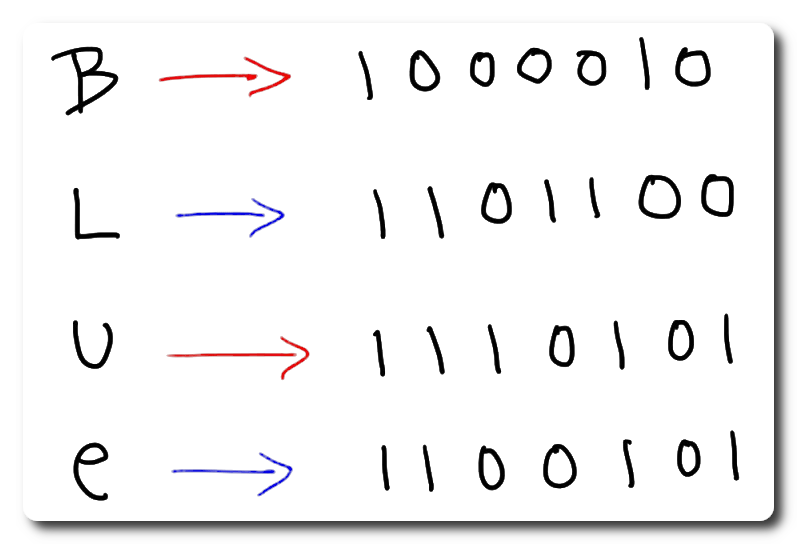

<h1 align="center">
  <br>
    
  <br><br>
  <i>bin-unbin me</i>
</h1>
<p align="center">A project to convert binaries to text, and text to binary</p>
<!-- #region Shields -->
<p align="center">
    <a href="https://github.com/nico-castell/bin-unbin/commits"></a>
    <a href="https://github.com/nico-castell/bin-unbin/releases"></a>
    <a href="LICENSE"></a>
    <a href="https://github.com/nico-castell/bin-unbin"></a>
</p>
<!-- #endregion -->

## Binme
Usage:

```bash
$ ./binme 'Some phrase'
01010011 01101111 01101101 01100101 00100000 01110000 01101000 01110010 01100001 01110011 01100101
```

## Unbinme
Usage:

```bash
$ ./unbinme 01010011 01101111 01101101 01100101 00100000 01110000 01101000 01110010 01100001 01110011 01100101
Some phrase
```

## How to build the project

**Prerequisites:** CMake, and a compiler for C/C++, ideally also an IDE.

This project uses *CMake* to configure the build environment, to prepare the build environment do the following:

```bash
$ cd /path/to/cloned_repo
$ cmake -S . -B build
```

If you're on a UNIX-like OS (:penguin:, :apple:) you can do as follows:
```bash
$ cd build
$ make
```

If you're on :checkered_flag: Windows you have to follow the steps for your default build tool.

You can also check the latest [release](https://github.com/nico-castell/bin-unbin/releases) for binaries in compressed archives, if you don't want to (or can't) compile the programs yourself.

## License

This repository is available under the [MIT License](LICENSE).
